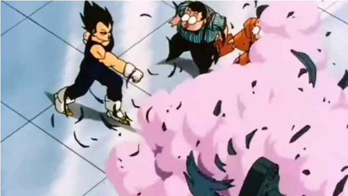

# Tecnicas-de-Combate

El mundo está lleno de héroes. Desde chiquitos y débiles, hasta gigantes musculosos, cada héroe tiene sus propias técnicas de combate.
Nuestra misión es determinar qué tan efectivos son sus golpes para determinados objetivos, de los cuales por ahora solamente nos interesa el nombre.

Se pide:

1. Lo primero que necesitamos medir es la presión que ejerce un golpe sobre un objetivo, que se calcula como poder del golpe / fortaleza del objetivo.
El poder de un golpe es igual a 15 veces las horas de entrenamiento que el héroe le ha dedicado a dicha técnica. Mientras que la fortaleza de un objetivo se calcula como el doble de la cantidad de letras de su nombre.

    Definir una función que dada una cantidad de horas de entrenamiento y el nombre de un objeto devuelva la presión que ejerce el golpe sobre el objetivo.

    Ejemplo:
    Un golpe con 200 horas de entrenamiento sobre una “bolsa de entrenamiento” ejerce 68 de presión (15*200)/(2*22)

2. Ya tenemos información de algunas técnicas de combate puntuales que llevan a cabo determinados héroes. Por ahora nos interesa tener en el sistema las siguientes técnicas:

    [Gomu Gomu Elephant Gatling](https://onepiece.fandom.com/wiki/Gomu_Gomu_no_Mi/Gear_Third_Techniques): es un golpe cuyo héroe le dedicó 180 horas de entrenamiento.
    [Golpes Normales Consecutivos](https://onepunchman.fandom.com/es/wiki/Golpes_Normales_Consecutivos): es un golpe cuyo héroe le dedicó 240 horas de entrenamiento.

    Ejemplos:
    La técnica de Golpes Normales Consecutivos ejerce una presión de 81 sobre la "bolsa de entrenamiento".
    Mientras que la técnica de Gomu Gomu Elephant Gatling ejerce una presión de 61 sobre la "bolsa de entrenamiento".

3. Por último, queremos sacar algunas estadísticas sobre los objetivos, basándonos en pruebas sobre técnicas ya conocidas. Para ello necesitamos saber

    Si un objetivo es difícil. Esto ocurre cuando la técnica de Gomu Gomu Elephant Gatling efectúa una presión menor a 100.
    Ejemplos:
    La "bolsa de entrenamiento" es un objetivo difícil,  un "puf" no lo es.

    Saber si un objetivo es accesible. Esto se cumple si la presión que ofrece unos Golpes Normales Consecutivos cuando se focaliza el objetivo está entre 200 y 400. Focalizar un objetivo implica quedarse con las primeras 7 letras de su nombre.
    Tip: Investigar la función take :: Int -> String -> String para obtener los primeros n caracteres de un string.
    
    Ejemplos:
    Una "bolsa de entrenamiento" es accesible. 
    Un "puf" no es accesible.

# Temas a evaluar

- Tipado de funciones
- Composición
- Aplicación Parcial
- Testing

